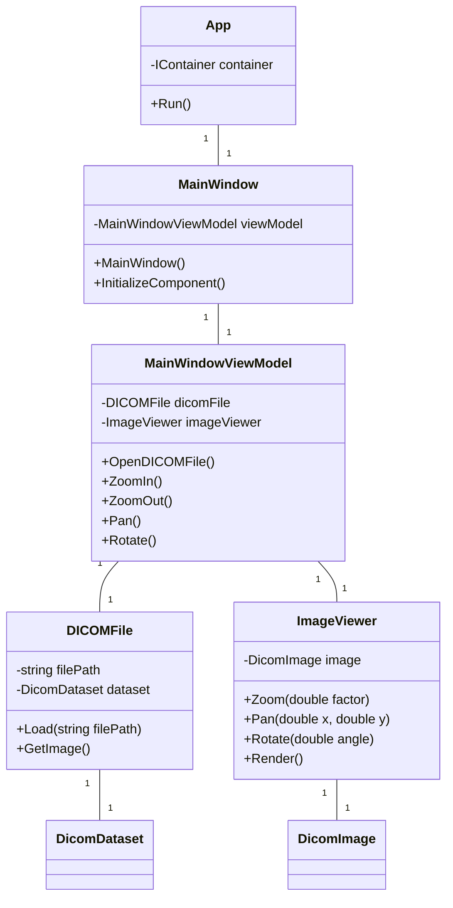
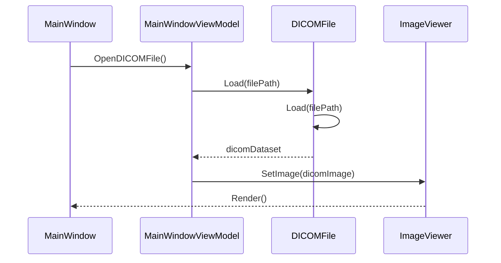
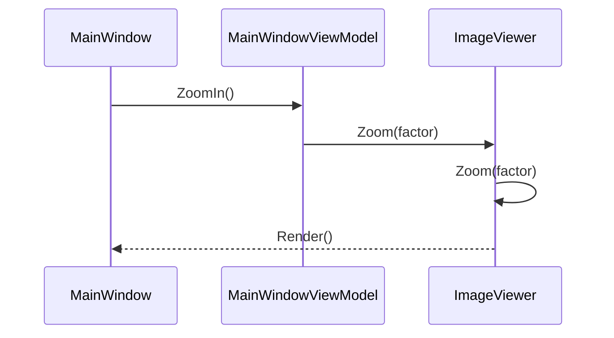
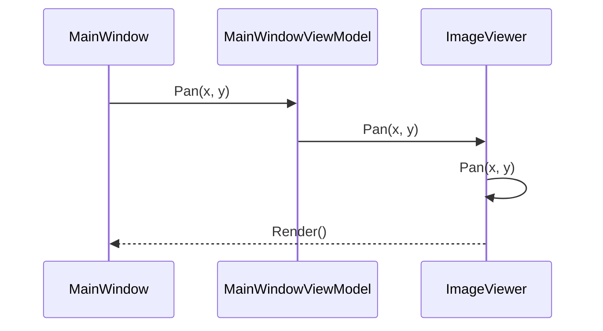
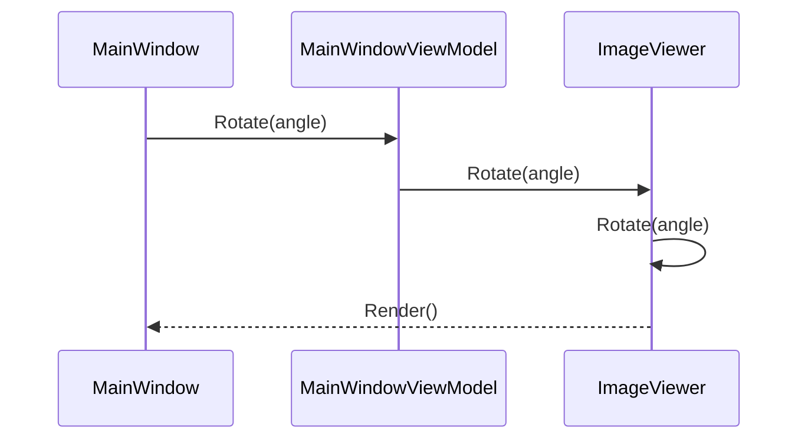

# DICOM Viewer デスクトップアプリ要件定義書

## ゴール
本アプリケーションはWPF (Windows Presentation Foundation) を使用して開発します。
技術学習を目的として、DICOMを使用したWindowsデスクトップアプリを作成する。C#を使用して最小限の機能のみ実装する。

## 使用するパッケージ
- fo-dicom: DICOMファイルの読み込みと操作を行うライブラリ

## 1. 目的
本システムの目的は、DICOM形式の医療画像ファイルを閲覧・操作できるデスクトップアプリケーションを開発することです。これにより、DICOM規格やC#プログラミングの学習を目的とします。

## 2. ファイル・フォルダ構成
```
DICOM Viewer
├── App.config
├── App.xaml
├── App.xaml.cs
├── MainWindow.xaml
├── MainWindow.xaml.cs
├── Models
│   ├── DICOMFile.cs
│   └── ImageViewer.cs
├── ViewModels
│   └── MainWindowViewModel.cs
└── Views
    └── ImageViewerControl.xaml
    └── ImageViewerControl.xaml.cs
```

## 3. クラス図


## 4. クラスの詳細

### App
- **説明**: アプリケーションの起点となるクラス。アプリの初期化と実行を担当する。
- **属性**:
  - `IContainer container`: 依存関係の管理を行うコンテナ
- **操作**:
  - `Run()`: アプリケーションを起動する

### MainWindow
- **説明**: アプリケーションのメインウィンドウを表すクラス。ユーザーインターフェースを担当する。
- **属性**:
  - `MainWindowViewModel viewModel`: メインウィンドウのビューモデル
- **操作**:
  - `MainWindow()`: コンストラクタ。ビューモデルのインスタンス化など、初期化処理を行う
  - `InitializeComponent()`: GUIコンポーネントの初期化を行う

### MainWindowViewModel
- **説明**: メインウィンドウのビジネスロジックを担当するクラス。
- **属性**:
  - `DICOMFile dicomFile`: DICOM画像ファイルを表すモデル
  - `ImageViewer imageViewer`: DICOM画像の表示を担当するビューモデル
- **操作**:
  - `OpenDICOMFile()`: DICOM画像ファイルを開く
  - `ZoomIn()`: 画像をズームインする
  - `ZoomOut()`: 画像をズームアウトする
  - `Pan()`: 画像をパンする
  - `Rotate()`: 画像を回転する

### DICOMFile
- **説明**: DICOM画像ファイルを表すクラス。ファイルの読み込みと画像データの取得を行う。
- **属性**:
  - `string filePath`: DICOM画像ファイルのパス
  - `DicomDataset dataset`: DICOM画像のデータセット
- **操作**:
  - `Load(string filePath)`: DICOM画像ファイルを読み込む
  - `GetImage()`: DICOM画像データを取得する

### ImageViewer
- **説明**: DICOM画像の表示と操作を担当するクラス。
- **属性**:
  - `DicomImage image`: 表示するDICOM画像
- **操作**:
  - `Zoom(double factor)`: 画像をズームする
  - `Pan(double x, double y)`: 画像をパンする
  - `Rotate(double angle)`: 画像を回転する
  - `Render()`: 画像を描画する

## 5. ユースケース

1. **DICOM画像ファイルを開く**
   - 関連するクラス: `MainWindowViewModel`, `DICOMFile`
   - 関連するメソッド: `OpenDICOMFile()`, `Load()`

2. **DICOM画像を表示する**
   - 関連するクラス: `MainWindowViewModel`, `ImageViewer`, `DICOMFile`
   - 関連するメソッド: `GetImage()`, `Render()`

3. **DICOM画像をズームする**
   - 関連するクラス: `MainWindowViewModel`, `ImageViewer`
   - 関連するメソッド: `ZoomIn()`, `ZoomOut()`, `Zoom()`

4. **DICOM画像をパンする**
   - 関連するクラス: `MainWindowViewModel`, `ImageViewer`
   - 関連するメソッド: `Pan()`

5. **DICOM画像を回転する**
   - 関連するクラス: `MainWindowViewModel`, `ImageViewer`
   - 関連するメソッド: `Rotate()`

## 6. シーケンス図

### DICOM画像ファイルを開く


### DICOM画像をズームする


### DICOM画像をパンする


### DICOM画像を回転する
